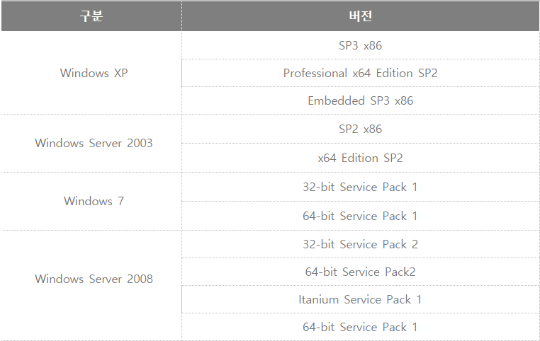
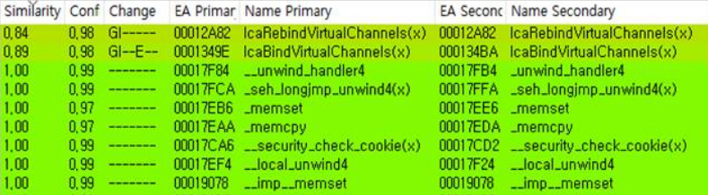
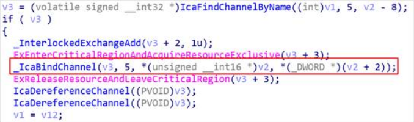
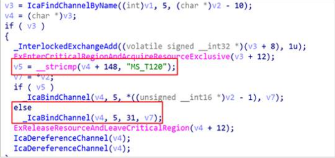
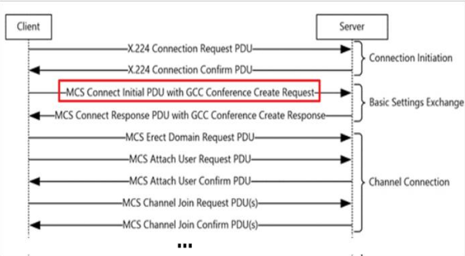
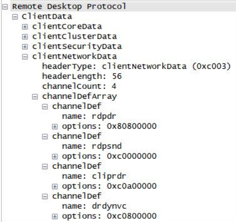
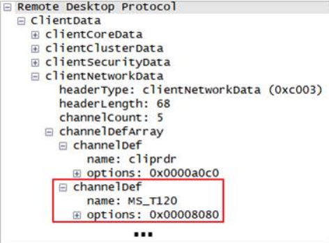
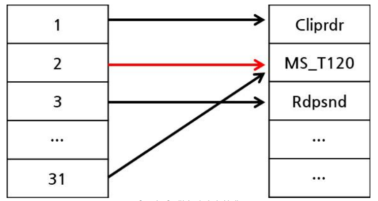
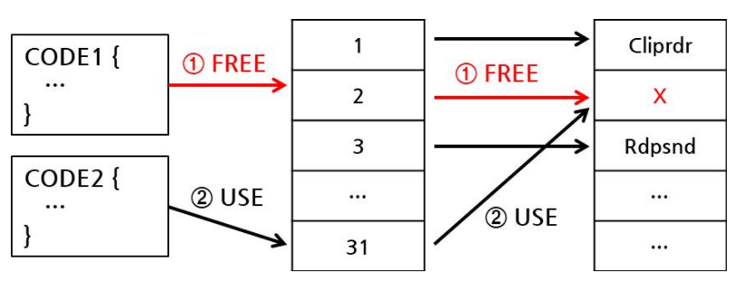

## **1. CVE-2020-9751** 
<u>***https://cve.mitre.org/cgi-bin/cvename.cgi?name=CVE-2020-9751***</u>
> **Naver Cloud**

> 취약점이 해결 되기 전 **2.2.2.11** 버전 에서는 **업그레이드** 하는동안 **해커의 서버에 있는 임의의 파일**을 **다운로드** 하고 **실행** 되어질 수 있었다.

> 구체적인 설명과 POC는 찾기가 힘들었다.


#### **NAVER의 취약점 목록**
<u>***https://cve.naver.com***</u>
<br/><br/>
---
***
---
<br/>

## **2. CVE-2019-0708** - BlueKeep
<u>***https://cve.mitre.org/cgi-bin/cvename.cgi?name=CVE-2019-0708***</u>
>[RDP프로토콜](https://m.blog.naver.com/yoodh0713/221567375594)에서 발견된 취약점

>해커가 따로 인증을 하지 않아도 서버에 코드 실행이 가능하다.

> <br/>- 이 취약점이 해당하는 버전 목록

### **취약점 분석**
> #### **1. 패치분석**<br/>
> 다음 명령어를 통해 **언패킹**이 가능함.  **RDP 서버**에 사용 되는 **termdd.sys** 드라이버 파일의 **내용 수정**되는데, **BindDiff** 도구를 이용해 **패치 전/후**를 비교하여 **유사도가 가장 낮은** 함수를 찾는다. <br/> 
>> - 패치파일이 .msu일 때<br/>
 ```> expand -F:* update.msu C:``` <br> ```> cd ```<br/>``` > expand -F:* update.cab C: ```
 >> - 패치파일이 .msp일 때
 <br/>```> msix patch.msp /out C:```
 >> - 패치파일이 .exe일 때<br/>```> pach.exe /x:C:\MS10-005\Extracted``` 

<br/>**BinDiff** 도구를 이용하여 패치 전/후 **termdd.sys**를 비교해 `IcaBindVirtualChannels`와  `IcaRebindVirtualChannels`함수가 변경된 것을 알 수 있다.

<br>
<br/>패치 전 `IcaBindVirChannelByName`

<br>
<br/>패치 후 `IcaBindVirChannelByName`

> #### **2. RDP in a Nutshell**<br/>
>> - **RDP 프로토콜**은 일련의 연결 과정을 통해 서비스를 제공한다. 이 과정에서 **클라이언트**는 **서버**에 명시적으로 **정적 채널**을 요청할 수 있는데 서버는 이 **요청된 채널**에 대하여 **채널 번호를 할당**하고 해당 채널을 통해 **메시지 송수신**이 가능하다.
<br><br/><RDP 연결 순서>
>> - 취약점에 사용되는 **MS_T120** 채널은 **RDP 연결에서 요청되는 채널이 아니며**, MS에서 **용도를 명시하지 않고** 프로그램 내부에서 **31번으로 할당**되어 사용되는 채널이다.<BR>
<br><BR><정상적인 RDP Initial PDU 패킷>

> #### **3. Use After Free(UAF)**<br/> 
>> - **메모리 참조**를 이용한 버그이다. **임의의 포인터가 비할당된 객체를 참조**하고 있다가 **해당 메모리에 접근을 시도**할 경우 발생된다.
>> - **1번**에서의 언패킹을 통해 찾아낸 `_IcaBindChannel` 함수는 **채널 객체**를 **특정 채널 번호**와 **연결**시키는데, 이때 **유저**가 명시적으로 **MS_T120** *(2번에서 설명한)* 채널을 **요청**할 경우, **임의의 번호**와 **MS_T120**객체가 연결된다. 그러나 **2번**에서 설명했듯이 이 객체는 이미 **31**번 채널이 **할당된 상태**이므로 **하나의 객체**에 **두 개의 채널 번호**가 할당되는 것이다.
<br><br><악성 RDP Initial PDU 패킷>
<br><br><채널 바인딩 상태> 
>> - **채널 2번**을 통해 **MS_T120**채널 객체를 참조하고 있는 **CODE1**에서 동작 중 해당 객체를 **FREE**한 이후에 **채널 31번**을 통해 **CODE2**에서 해당 객체를 사용하면 **UAF취약점**이 발현된다. 
<br><br><채널 바인딩 상태> 

##### 출처 : http://igloosec.co.kr/BLOG_BlueKeep%20(CVE-2019-0708)?bbsCateId=1

### **POC**
### ***https://github.com/zerosum0x0/CVE-2019-0708/tree/master/poc***


