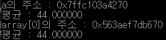
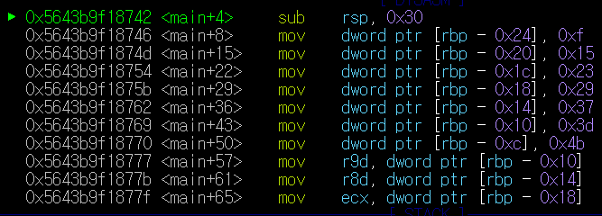
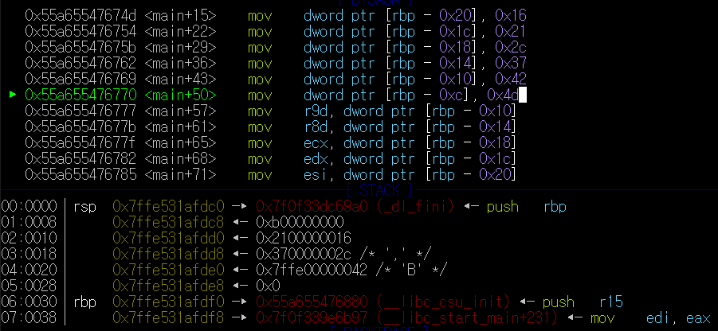
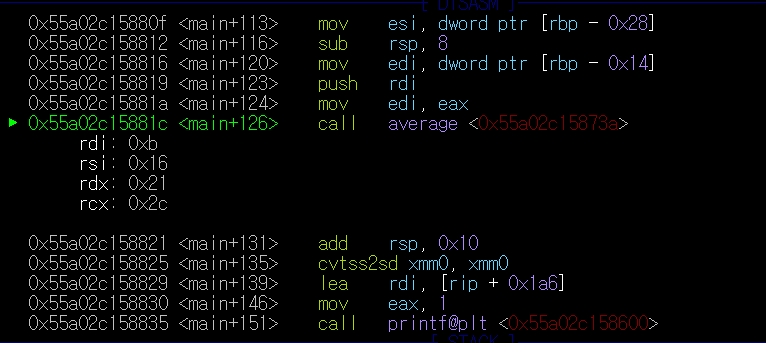
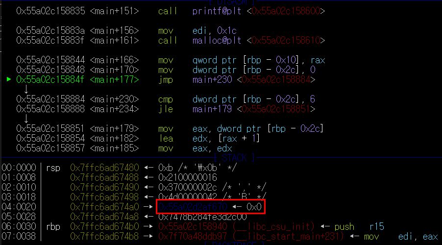
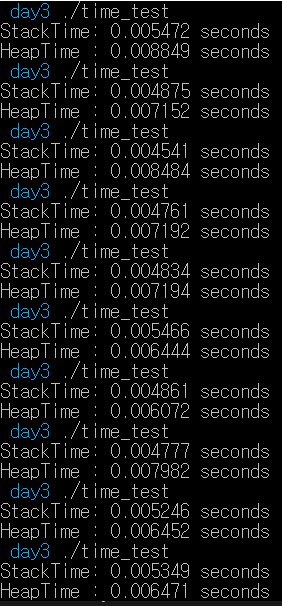

# 배운내용 확인

### 배운내용을 확인 하기 위해 간단한 예제를 만들었다.

```
#include <stdio.h>
#include <stdlib.h>
float average(int n1, int n2, int n3, int n4, int n5, int n6, int n7){
    float result =( n1+n2+n3+n4+n5+n6+n7)/7;
    return result;

}

int main(){

    int a=11, b=22, c=33, d=44, e=55, f=66, g=77;
    printf("a의 주소 : %p\n",&a);
    printf("평균 : %f\n",average(a,b,c,d,e,f,g));

    int *array = malloc(sizeof(int)*7);
    for(int i=0;i<7;i++){
        array[i]=(i+1)*10+i+1;
    }
    printf("array[0]의 주소 : %p\n",&array[0]);
    printf("평균 : %f\n", average(array[0],array[1],array[2],array[3],array[4],array[5],array[6]));
    free(array);
    return 0;
}
```
코드를 실행하면 다음과 같은 결과를 얻는다.
<br><br>
11로 초기화 해준 변수 **a**는 Stack영역에 할당된다. (이를 선언해준 함수가 종료되면 소멸된다.)

동적할당을 해준 array[0]은 Heap영역에 할당된다.

위 코드를 실행 후 gdb로 디버깅을 해 분석해보았다.<br>
***
<br>
변수를 a~g까지 총 7개 선언 했으므로 `sub rsp, 0x30`을 한 것이 보인다.<br>*< 0x10에 4개의 정수를 저장할 수 있다. >*
<br><br>
현재 까지 `int a=15, b=21, c=35, d=41, e=55, f=61, g=75;`를 수행한 모습이다.
<br><br>
파라미터를 받은 average함수가 구현되는 모습이다.
<br><br>
malloc함수를 통해 Heap에 할당한 메모리들을 다음 구문으로 할당해주는 모습이다.


```
for(int i=0;i<7;i++){
        array[i]=(i+1)*10+i+1;
    }
```
파란색 글씨로 된 부분이 Heap영역중 하나의 주소값이다.

# Heap vs Stack
그렇다면 Heap과 Stack의 속도차이는 어떨까?

다음과 같은 코드로 속도 측정을 해보았다. 
```
#include <cstdio>
#include <chrono>

int main()
{
    auto begin = std::chrono::system_clock::now();
    int a[1000000];
    for (int i = 0; i < 1000000; ++i){a[i]=i;}

    auto end = std::chrono::system_clock::now();

    std::printf("StackTime: %f seconds\n", std::chrono::duration<double>(end - begin).count());

    begin = std::chrono::system_clock::now();
    int *b=new int[1000000];
    for (int i = 0; i < 1000000; ++i){b[i]=i;}
    delete(b);
    end = std::chrono::system_clock::now();

    std::printf("HeapTime : %f seconds\n", std::chrono::duration<double>(end - begin).count());
    return 0;
}
```
<br><br>


Stack은 이미 생성되어 있는 스택에 대해 포인터의 위치만 바꿔주는 단순연산이고, Heap은 할당된 chuck의 크기, 현재 메모리의 fragmentation상황 등 다양한 요소를 고려하기 때문이다.

 

