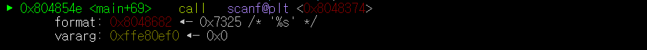
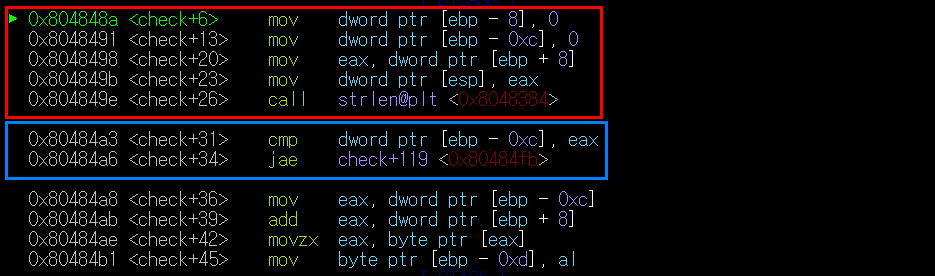
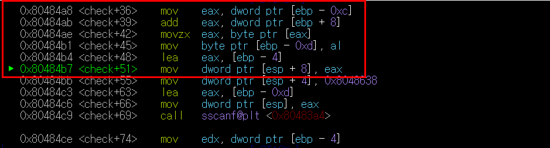
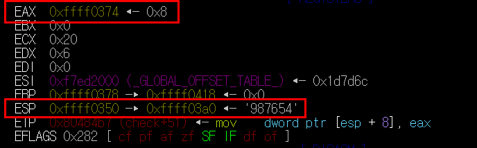
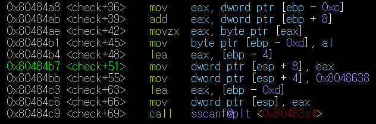
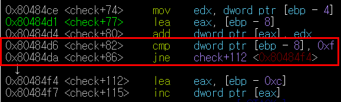
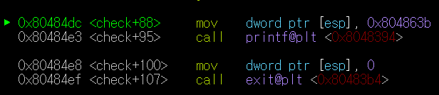

# **1. crackme0x04**

>**input**의 **첫번째 자리**부터 숫자를 더해나가 15가 되면 PASS

>EX
>> - 15345  - 1+5+3+4 = 13   - 1+5+3+4+5 = 18 이므로 15가 되는 순간이 없다. (실패)
>> - 123456444444  - 1+2+3+4+5 = 15 이므로 (성공)
***
>  
`0xffe80ef0`에 input을 저장하는 과정
  
빨간색 부분에서 input의 글자 수를 세서 **eax**에 저장한다.
 파란색 부분에서 **ebp-0xc**와 **eax**를 비교한 후 만약 `ebp-0xc >= eax`이면 **check+119**(*wrong 프린트 후 종료*)로 보낸다. 밑에서 보면 알겠지만 **ebp-0xc**는 1씩 증가한다. 즉, input의 첫번째 글자부터 체크하며 input의 끝까지 도달했을 때, 성공과 실패를 판단하지 못했다면 실패를 반환하는 것이다. 
***
>  
빨간색 부분에서 input의 현재 index(**ebp-0xc**)번째 부분을 **eax**에 저장한다.
***
>  
input으로 987654를 입력했고, 현재 **ebp-0xc**가 2인 상황에서 **EAX**에 8이 저장된 모습을 볼 수 있다.
***
>   
~~자세한 과정은 솔직히 잘 모르겠다.~~
 결과적으로 **ebp-8**에 현재까지의 합이 저장되어 있음을 알 수 있다.  
빨간색 부분에서 현재까지의 합(**ebp-8**)과 0xf(15)를 비교하여 다르면 `check+112`로 가서 반복문을 다시 실행하고 아니면 `check+82`와 `check+112`사이의 어딘가로 가서 맞다는 출력을 뽑는다. 
  
이 부분이 바로 `check+82`와 `check+112`사이에 숨겨져 있던 부분이다. 조건에 맞는 input을 입력했을 때 볼 수 있다. 그리고 check함수를 return하며 종료한다.

