# bomb

## 1. 문제 설명

> 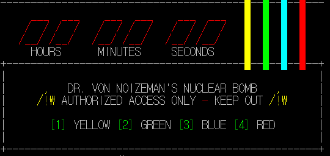  1,2,3,4 숫자를 입력하면 해당 선을 자를 수 있는 퀘스트를 수행할 수 있다. 각 줄에 해당하는 암호를 입력하여 모든 줄을 끊으면 성공한다.
## 2. 문제 해결 

> 우선 **gdb**를 이용해 디버깅해서 전체적인 흐름을 살펴보았다.  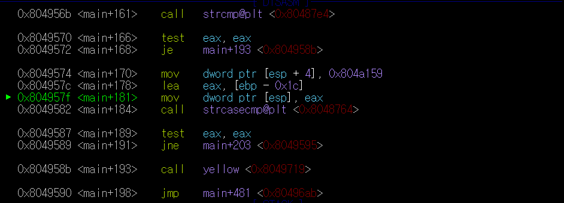  아무런 생각 없이 ni를 계속 입력하다 보니 `yellow` 함수와 마주쳤다. 여기서 나는 이후에 내가 입력한 숫자를 **1,2,3,4**와 각각비교하며 `yellow`,`green`,`blue`,`red`를 call 할 것이라는 예상을 할 수 있었다.

YELLOW 풀이 (DONE)

> 해결해야 할 문제는 `yellow`이므로, `yellow`함수로 들어가 보았다.  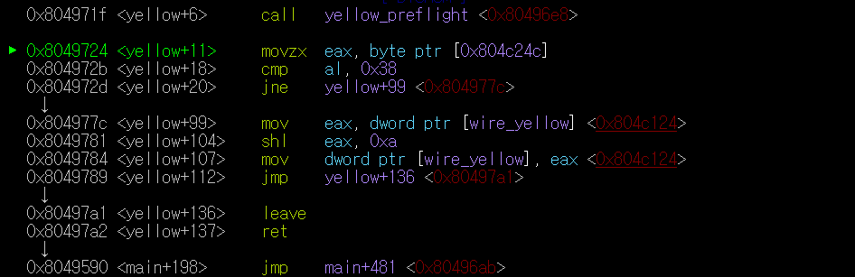 `yellow-preflight`라는 함수에서 암호를 입력받고 자세한건 모르겠지만 그 이후로 뭔가 한글자 한글자씩 비교를 하며 여러 분기가 있다는 것을 알 수 있었다.

> 여기서 나는 배웠던 **rabin2**를 이용해 디버깅해서 그래프를 보고 싶었다.  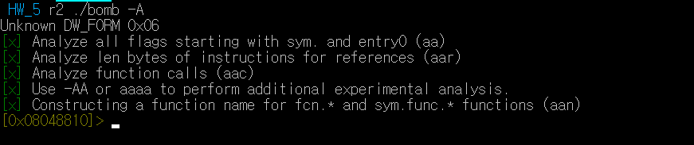 `r2 ./filename -A`*를 통해 analyze를 한 채로 디버깅모드로 진입할 수 있다.*

> `s main`을 통해 main함수로 들어갈 수 있고 `VV`를 입력하면 현재 함수의 그래프를 볼 수 있다.  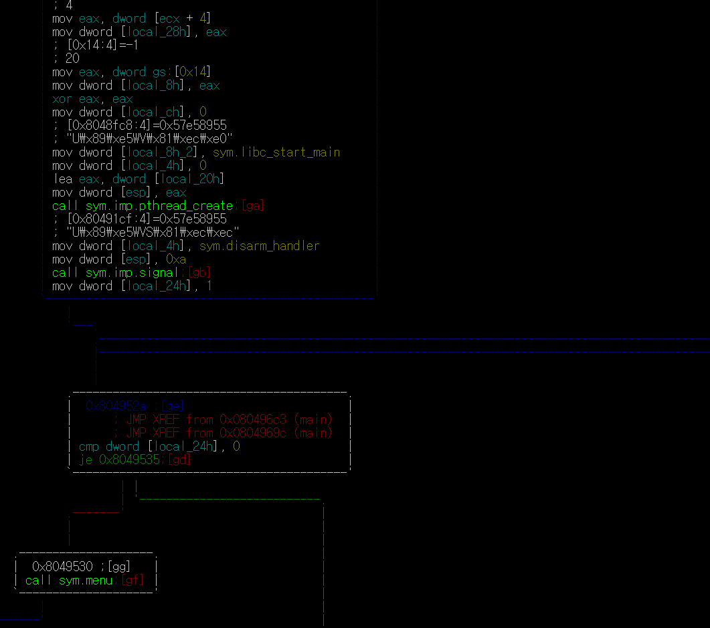  main에서 어떤 분기에서 어떤 함수로 가는지 그래픽요소로 볼 수 있어서 정말 좋았다. *Tip : 함수마다 tag?가 있는 것을 볼 수 있다. 그림에서 main함수 안에서는 `call sym.imp.signal;[gb]` 그 밑에있는 파란색 함수는 `[ge]`, 그 밑 흰색은 `[gg]`  여기서 `gb`,`ge` 명령어를 입력하면 해당 함수로 바로 들어가진다! 또한 `u`를 입력하면 바로 전 함수로 돌아와진다. (병민이형이 알려줬당)*

> 어쨌든 밑으로 쭉 내려오다 보면 `yellow`함수를 콜하는 부분을 볼 수 있다.  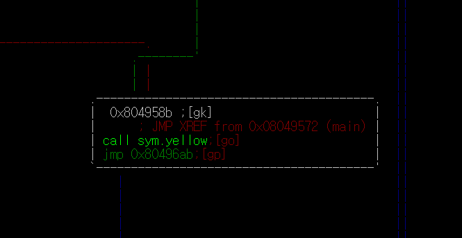 *이렇게 밑으로 내려오면서 볼 수도 있고 **gdb**를 이용해 함수 주소값을 찾은 뒤 주소값으로도 찾을 수 있다.*

> 찾은 `yellow`함수를 보기 위해 명령어 `go `를 입력해서 들어가 보았다. 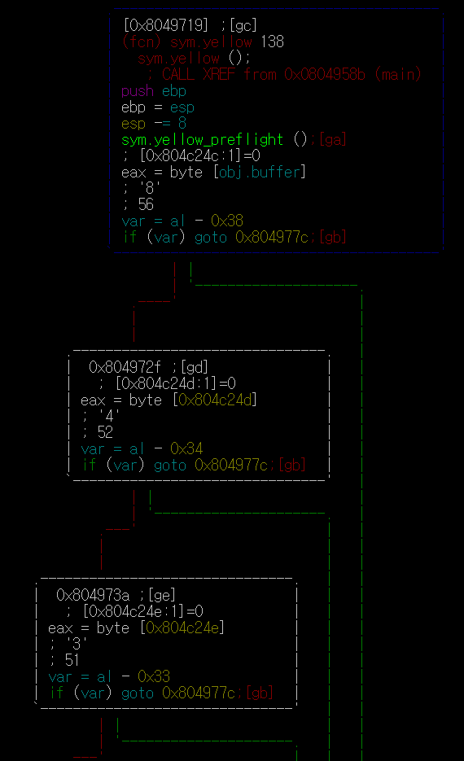 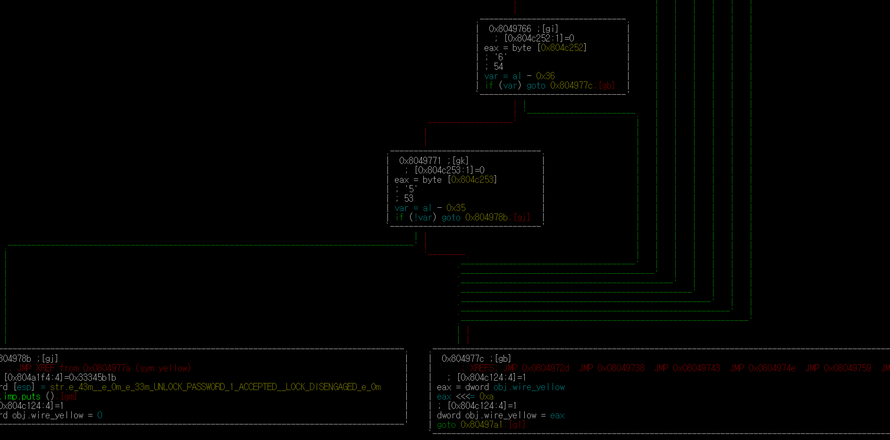 `yellow`함수로 들어와 밑으로 내려가며 쭉 확인을 해보았다. 맨 위 `[gc]`함수 내부에  `if(var) goto 0x804977c;[gb]` 를 볼 수 있다. 그 밑 `[gd]`부터 `[gi]`까지에서도 똑같은 조건문을 볼 수 있다. 그리고 맨 마지막 조건 `[gk]`를 보면 `if(!var) goto 0x804978b;[gj]`가 있다. 여기서 나는 처음에서 하나씩 비교하며 틀리다면 `[gb]`로 가서 실패를 처리하고 맨 마지막조건 까지 도달 했을 때 조건에 맞다면 `[gj]`로 가서 성공을 처리하는 것을 생각할 수 있었다.

> 다시 처음 `[gc]`로 가서 살펴보았다. 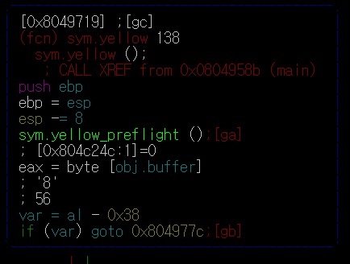 아까 **gdb**로 디버깅 했을 때 찾았던 `yellow_preflight`함수가 보인다. 이 함수에서 암호를 입력받았던 걸 기억해야 한다. 명령어 `ga`를 통해 `yellow_preflight`함수 내부로 들어가보았다. 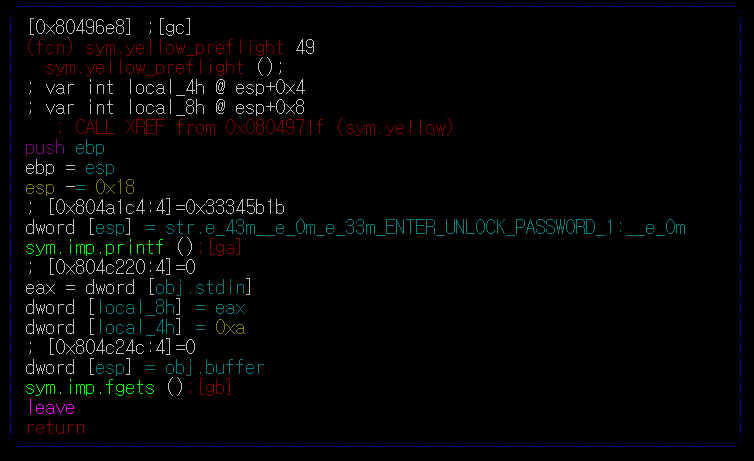 무엇인가를 열심히 쭉쭉 하다가 `fgets`함수를 통해 입력받는 것을 확인할 수 있었다. 

> 명령어 `gb`를 통해 `fgets`함수로 들어가 보았다.  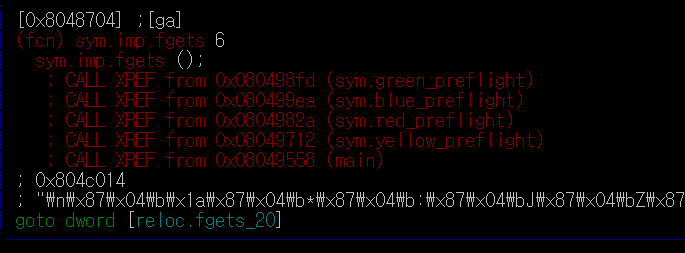 일단 이 함수가  `green_preflight` `blue_preflight` `red_preflight` `yellow_preflight` 총 네개의 함수에서 call된다는 것을 볼 수 있었고, `0x804c014`에 저장하는 것을 알 수 있었다.

> 다시 나와서 `[gc]`를 살펴보았다.   `obj.buffer`는 내가 입력한 input의 첫 주소와 같다. 그리고 그 값을 `eax`에 저장한다. `al`은 `eax`(32bit)의 하위 8bit(1byte)만을 가리키므로 input의 첫 글자만 따온 것이다. 그 후, 그 글자를 `0x38`(8)과 비교하여 다르면 `[gb]`로 가서 실패를 처리하는 것이다.

>  그 다음으로 `obj.buffer`의 주소값에서 하나씩 증가하며 `0x34`, `0x33`, `0x37`, `0x31`, `0x30`, `0x36`, 마지막으로 `0x35`와 비교하며 조건을 마무리 한다.

>즉 답은 84371065임을 알 수 있다! 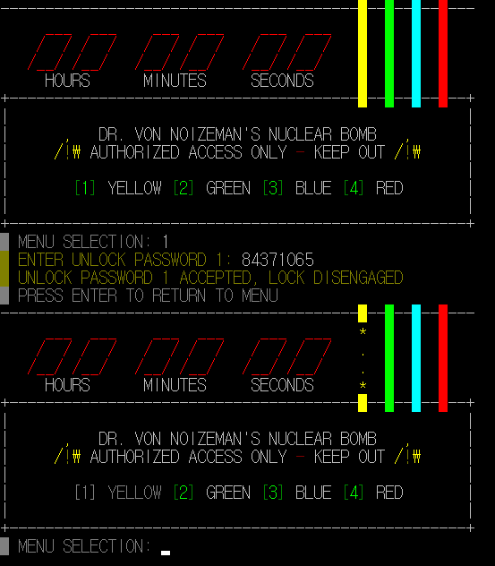

GREEN 풀이 (UNDONE)

BLUE 풀이 (UNDONE)

RED 풀이 (UNDONE)

