# bof3 ~ bof5 풀이

<details>
<summary>bof3 풀이</summary>
<div markdown="1">
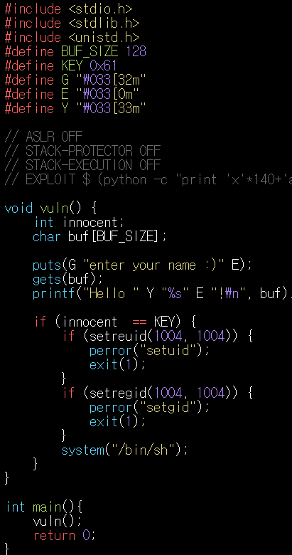 bof3.c 코드<br>

> `main`함수에서 `vuln`함수를 바로 call하고 `vuln`함수 내부에서 `gets`를 통해 입력을 받는다.<br>선언된 변수 `innocent`는 `buf[BUF_SIZE]`보다 위에 존재하므로 `innocent`와 `buf`의 주소 차이만큼 overflow를 통해 값을 입력해준다면 `innocent`에 **원하는 값**을 넣어줄 수 있다.

> `innocent` 주소를 구해보자.<br>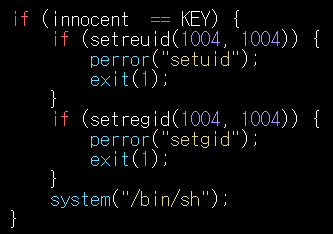<br>`innocent`와 `KEY`를 비교하는 구문이 보인다. **gdb**를 통해 함수 내부로 들어가 보면<br>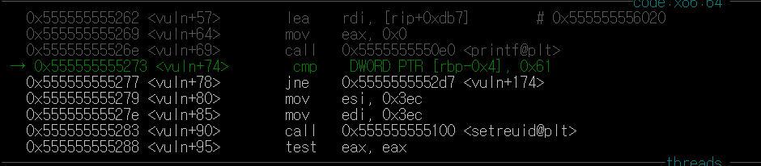<br>현재 부분에서 비교하는 모습을 찾을 수 있다. 즉 `innocent`는 `rbp-0x4`에 저장되어 있으므로 `rbp-0x4`의 주소값을 찾는다.<br>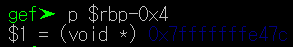

> `buf`의 주소를 구해보자.<br>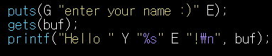<br>`gets`를 통해 `buf`에  저장하는 것을 볼 수 있다. **gdb**를 통해 함수 내부로 들어가보면 <br>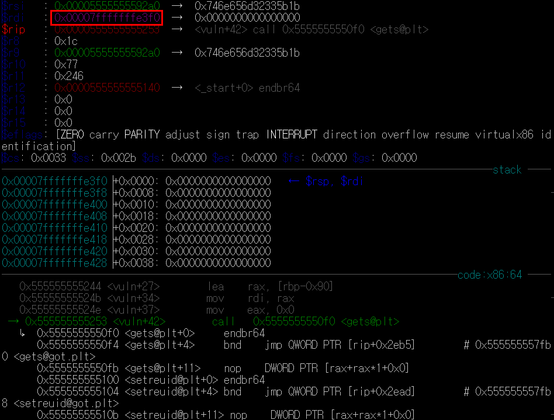<br>현재 `get`를 수행할때 `rdi`의 주소가 `buf`의 주소임을 알 수 있다. `rdi`의 주소는 빨간 네모로 표시해놓았다.

> 아까 찾은 `innocent`의 주소와 `buf`주소의 차이를 10진수로 구해보면 120이 나온다.  <br>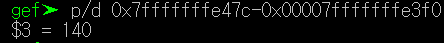

> 즉 120만큼 아무값이나 채워주고 그 뒤에 원하는 **KEY**값을 넣어주면 `buf`위에 있는 `innocent`에 **KEY**값이 들어가게 된다. **KEY**값은 0x61이었으므로 4byte인 `innocent`에 리틀엔디안방식으로 값을 넣어준다. <br> `gets`함수를 통해 input을 받으므로<br>`(python -c "print 'x'*140+'a\x00\x00\x00'";cat) | ./bof3` <br>를 입력한다.<br>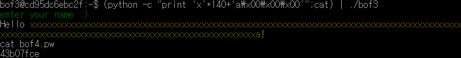
</div>
</details>
<details>
<summary>bof4 풀이</summary>
<div markdown="1">
> 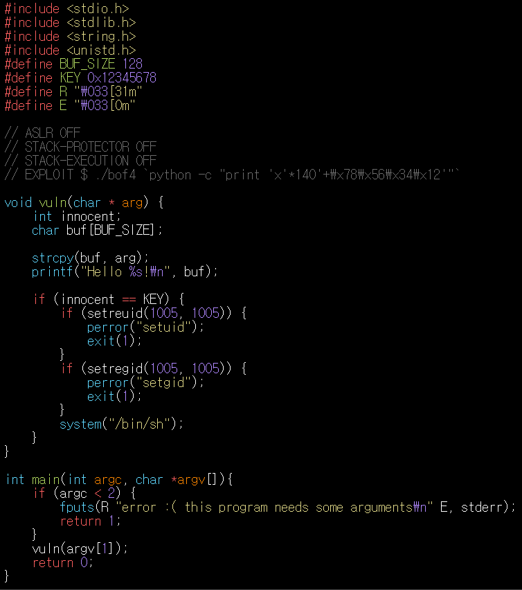 -bof4.c 코드-

> `main`함수를 보면 `argc`가 2미만일 땐 실패를 리턴한다. 즉 `main`의 파라미터를 2개 이상 주면 된다는 뜻이다.<br>`vuln`의 파라미터로 `argv[1]`값을 넣어주는 것을 볼 수 있는데 `argv[1]`은 첫번째로 입력된 파라미터이다.<br>`vuln`함수를 보면 `bof3.c`와 매우유사함을 볼 수 있는데, 차이점은 `buf`에 `main`의 첫번째 파라미터를 복사한 것이다.

> `bof3`에서 했던 방법을 그대로 사용하여 `buf`의 첫주소와 `innocent`의 첫주소의 사이공간에 아무값을 넣어 채워주고(=`main`함수의 첫번째 파라미터) 그 뒤에 **KEY**값을 리틀앤디언 형식으로 `innocent`에 넣어주면 된다.

> 여기서 주의할점은 `bof3`와 달리 `main`함수에 파라미터를 그대로 전달해주기 때문에 `bof3`에서 썼던 인풋방식말고 그냥 파라미터를 그대로 전달해주는 인풋방식을 사용해야 한다.

> ```./bof4 `python -c "print 'x'*140+'\x78\x56\x34\x12'"` ```<br>를 입력해주면 다음과 같은 결과를 얻는다.<br>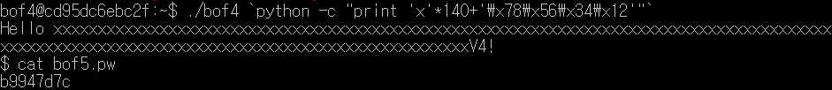<br>
</div>
</details>
<details>
<summary>bof5 풀이</summary>
<div markdown="1">
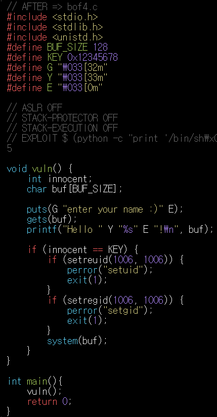bof5.c코드<br>

> bof4와 매우 유사함을 볼 수 있다. 심지어 **KEY**값도 똑같다.<BR>다른점은 바로 `system`함수의 파라미터로 `/bin/sh`가 아닌 `buf`가 들어간 모습을 볼 수 있다. `buf`에 string값으로 "/bin/sh"과 문자열의 끝을 알리는 null값을 하나 채워주면 `system(/bin/sh)`과 똑같은 기능을 하게 할 수 있다.

> `innocent`까지 도달하기 위해 140byte만큼 아무 값을 채워넣어야 하지만 "/bin/sh"+null 값을 넣어야 하기 때문에 **140byte-8byte=132byte**만큼만 아무 값을 채워넣어줘야 한다. <br> **그러면 `system(buf)`는 `system(/bin/sh)`와 같은 기능을 하여 쉘의 절대경로 프로세스를 실행시켜 권한을 얻는다.**<br> `bof4`와 다르게 gets함수를 통해 input을 받으므로 `bof3`에서 입력을 해준 방식을 사용한다.

> `(python -c "print '/bin/sh\x00'+'x'*132+'\x78\x56\x34\x12'";cat) | ./bof5`<Br>을 입력하면 다음과 같은 결과를 얻는다. `\x00`은 문자열의 끝을 알리는 기능을 한다.<br>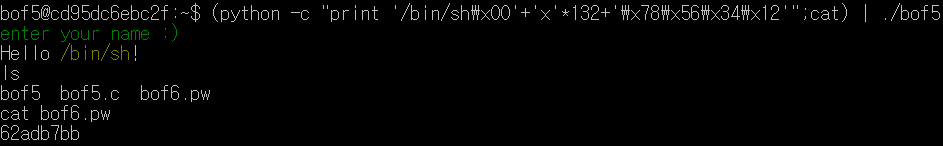<br>

</div>
</details>