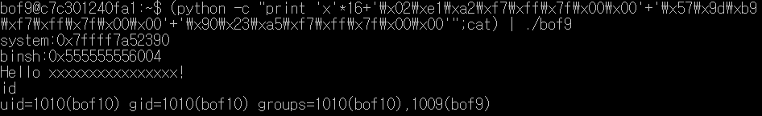

# bof9 풀이

bof9.c 코드

> 일단 `return`주소와 입력을 받는 `buf`의 첫 주소의 차이를 알아야 한다. <br>**지금까지 너무 많이 했으므로 과정은 pass하겠다!**<br>두 개의 주소차이를 구한 결과 **16**이 나왔다!<br>`bof8`과 같이 **27byte**인 쉘코드를 넣기엔 너무 작다. 그런데 `bof8`처럼 환경변수를 리턴해주는 `getenv`함수도 없다.

> 그럼 어떤 방법을 사용하면 될까?<br>가장 먼저 생각나는건 `system("/bin/sh")`이다. 이 코드를 `buf`위의 `return`주소에 넣으면 될 것 같다.<br>그러면 `return`주소에 `system("/bin/sh")`는 어떻게 넣을까? 다음부터 시작하겠다.

> 일단 `system`함수를 콜해야 하므로 `system`함수의 주소값을 알아보자.<br>**gdb**내부에서 `p system`명령어를 통해 `system`함수의 주소값을 찾을 수 있다.<br>

> `system`함수의 주소는 알았고 이제 `system`함수가 call될때 **rdi**값에 **/bin/sh**을 넣어야 한다. 일단 **/bin/sh**의 주소를 찾아야 한다. <br>**gdb**내부에서 `search pattern /bin/sh`를 입력하여 다음과 같은 결과를 얻을 수 있다.<br><br>다음과 같이 여러 부분에서 **/bin/sh**이 나타나는 것을 볼 수 있고 `/tmp/2.23/lib/libc.so.6`(**실행권한도 있다**)에서 사용되는 `/bin/sh`의 시작 주소를 메모한다. (`0x7ffff7b99d57`)

> **/bin/sh**의 주소도 알았고 이제 `system`함수가 call될 때 `rdi`에 위에서 찾은 **/bin/sh**의 주소를 넣어주면 된다. <br>우리가 사용할 건 `pop rdi; ret`이다. 다음 설명을 보면 이해가 된다. 그림처럼 stack에 저장이 되어있다고 가정해보자.<br><br>우선 `buf`위의 `return`주소에 `pop rdi; ret`명령어가 있다고 가정한다. 그러면 해당 `return`(`pop rdi; ret`)가 실행 될때 현재 **stack pointer**는 `/bin/sh`를 가리키고 있고 `pop rdi`명령어를 통해 현재 **stack pointer**가 가리키고 있는 `/bin/sh`이 pop되어 `rdi`에 저장된다. 그리고 `ret`명령어를 통해 되돌아와서 `system`함수를 실행시키면 `rdi`에 `/bin/sh`가 저장된 채로 `system`함수를 call하게 된다. 즉 `system("/bin/sh")`와 같은 동작을 하게 되는 것이다.

>그러면 `pop rdi; ret`은 어떻게 찾을까? `ROPgadget.py`함수를 통해 쉽게 찾을 수 있다. 다음 명령어를 입력한다.<br>`ROPgadget.py --binary /tmp/2.23/lib/libc.so.6 | grep "pop rdi ; ret"`<br>여기서 `/tmp/2.23/lib/libc.so.6`는 아까 `/bin/sh`을 찾을 때의 위치였고 `grep "pop rdi ; ret"`은 "pop rdi ; ret"이라는 문자열이 어셈블리코드에 나타날때 찾을 것이라는 뜻이다. 위 코드를 실행하면<br><br>다음과 같은 결과가 나온다. 여기서 옆에 주소 값은 `/tmp/2.23/lib/libc.so.6`의 시작주소로부터 해당 instruction이 떨어진 거리 (**offset**)을 의미한다. 즉 `/tmp/2.23/lib/libc.so.6`의 시작주소 + offset을 하면 `pop rdi ; ret`의 주소를 정확하게 뽑아낼 수 있다.<br>**gdb**내부에서 `vmmap`명령어를 통해 쉽게 `/tmp/2.23/lib/libc.so.6`의 시작주소를 찾아낼 수 있다.<br><br>`/tmp/2.23/lib/libc.so.6`의 시작주소와 **offset**을 더하면 다음과 같은 결과가 나온다.<br><br>이 결과가 바로 `pop rdi ; ret`을 실행시킬 수 있는 주소이다.

>이제 다 구했으니 정리를 해보자. <br><br>`buf`와 `return`주소의 차이 : 16<br>`pop rdi; ret`의 주소 : `0x7ffff7a2e102`<br>`/bin/sh`의 주소 : `0x7ffff7b99d57`<br>`system`함수의 주소 : `0x07ffff7a52390`<br><br>이 찾은 값들을 위 stack구조 그림처럼 더하면 된다. <br>`buf`에 `쓰레기값*16 + ret(pop rdi ; ret의 주소) + /bin/sh의 주소 + system함수의 주소`를 넣어주면 된다!<br>***(주소는 리틀앤디언 방식을 통해 넣어주고 `\x00`을 추가하여 8byte로 꽉차게 만들어준다.)***<Br>``` (python -c "print 'x'*16+'\x02\xe1\xa2\xf7\xff\x7f\x00\x00'+'\x57\x9d\xb9\xf7\xff\x7f\x00\x00'+'\x90\x23\xa5\xf7\xff\x7f\x00\x00'";cat) | ./bof9 ```<br>다음 명령어를 입력하여 루트쉘을 탈취한당<br>
