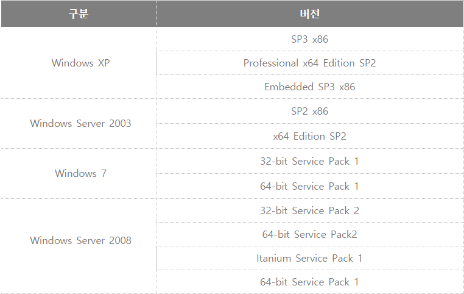

## **1. CVE-2020-9751** 
> **Naver Cloud**

> 취약점이 해결 되기 전 **2.2.2.11** 버전 에서는 **업그레이드** 하는동안 **해커의 서버에 있는 임의의 파일**을 **다운로드** 하고 **실행** 되어질 수 있었다.

> 구체적인 설명과 POC는 찾기가 힘들었다.

***https://cve.mitre.org/cgi-bin/cvename.cgi?name=CVE-2020-9751***

#### **NAVER의 취약점 목록**
***https://cve.naver.com***

## **2. CVE-2019-0708** - BlueKeep
>[RDP프로토콜](https://m.blog.naver.com/yoodh0713/221567375594)에서 발견된 취약점

>해커가 따로 인증을 하지 않아도 서버에 코드 실행이 가능하다.

> - 이 취약점이 해당하는 버전 목록

